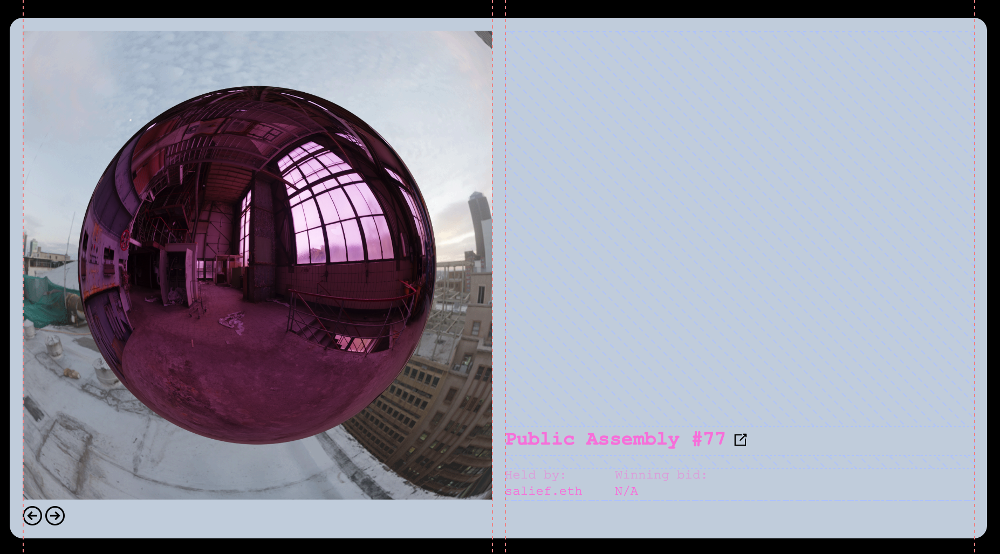
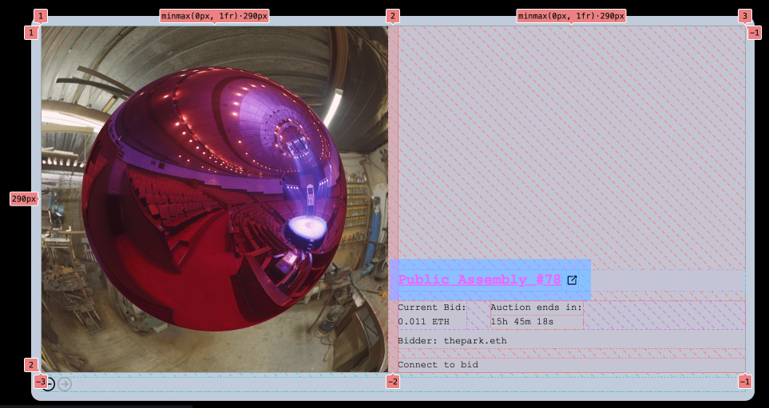
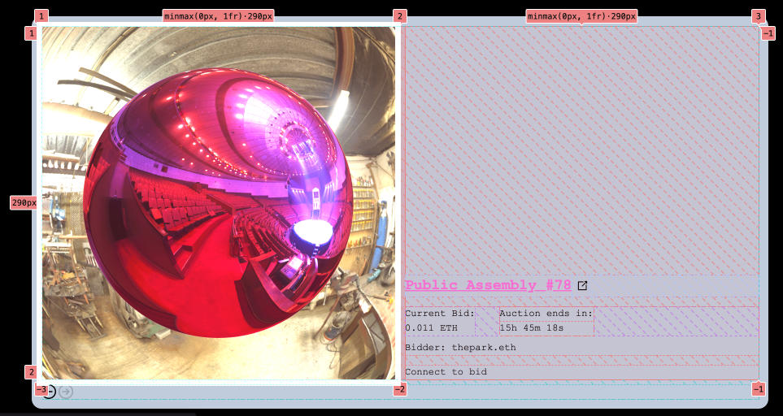
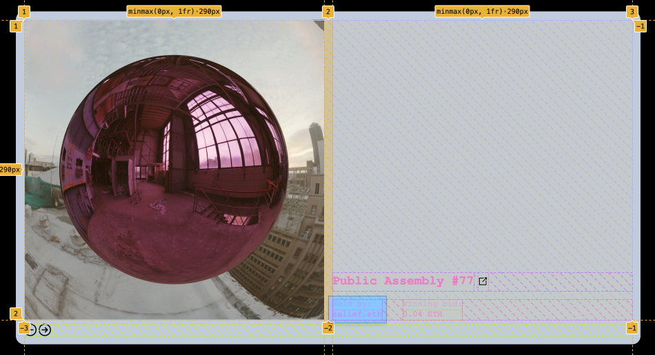
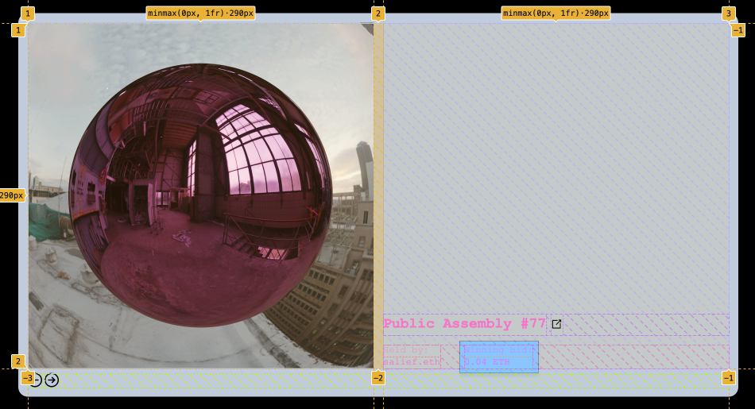
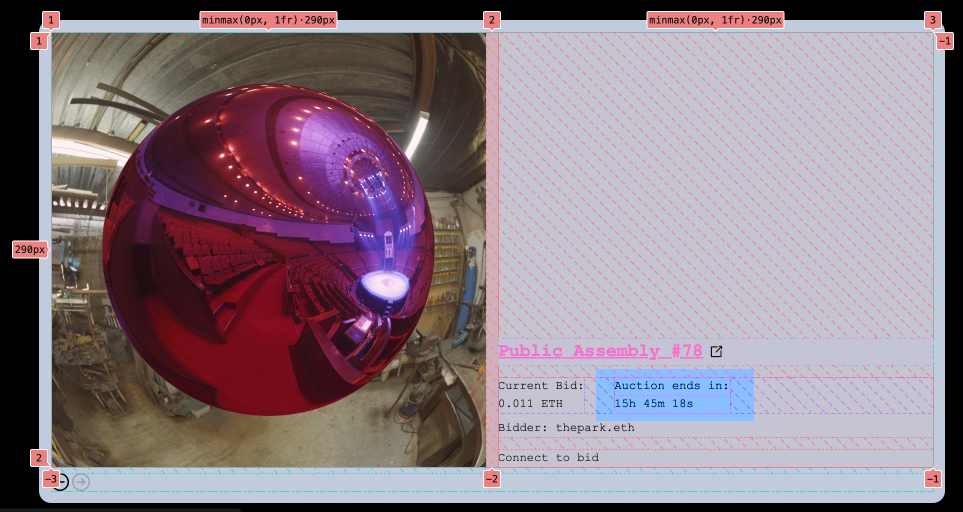

import { Callout, Tab, Tabs } from "nextra-theme-docs";
import { OptionTable } from 'components/table'


<Callout type="warning" emoji="⚠️">
  This page is under construction.
</Callout>
<Callout type="info" emoji="ℹ️">
  Showcase data and enable user interactions with resuable components.
</Callout>

## TokenRenderer

Displays a two-column div element that shows DAO Art and settled auction information, including the title of the DAO NFT, token ID, current holder information, etc.

```tsx copy filename="tokenRenderer.tsx"
export default function AuthCheck({
  formUI,
  connectCopy,
}: {
  formUI?: JSX.Element
  connectCopy?: string | JSX.Element
}) {
  const { isConnected } = useAccount()
  return <div>{!isConnected ? <Connect connectCopy={connectCopy} /> : formUI}</div>
}
```
| Property               | Type       | Description |
| -------------------- | -------- | ------- |                                                                                               
| connectCopy| String or JSX element | Message to the user once connected |
| formUI | JSX element | UI will be rendered if the user is connected |

<Tabs items={["Example 1", "Example 2"]} storageKey="selected-pkg-manager" defaultIndex="0">
    <Tab>
      ```ts copy
      import { useActiveAuction } from "@public-assembly/dao-utils";
      
      function App() {}
      ```
    </Tab>
    <Tab>
      ```sh copy
      lorem
      ```
    </Tab>
  </Tabs>

  > Note: 


## CurrentAuction

Displays information about a token auction, such as the current highest bid, remaining time, and highest bidder, and enables users to place a bid if authenticated by connecting to the Zora Nouns protocol.

```tsx copy filename="CurrentAuction.tsx"
export default function AuthCheck({
  formUI,
  connectCopy,
}: {
  formUI?: JSX.Element
  connectCopy?: string | JSX.Element
}) {
  const { isConnected } = useAccount()
  return <div>{!isConnected ? <Connect connectCopy={connectCopy} /> : formUI}</div>
}
```

| Property             | Type     | Description |
| -------------------- | -------- | ------- |                                                                                               
| connectCopy| String or JSX element | Message to the user once connected |
| formUI | JSX element | UI will be rendered if the user is connected |

<Tabs items={["Example 1", "Example 2"]} storageKey="selected-pkg-manager" defaultIndex="0">
    <Tab>
      ```ts copy
      import { useActiveAuction } from "@public-assembly/dao-utils";
      
      function App() {}
      ```
    </Tab>
    <Tab>
      ```sh copy
      lorem
      ```
    </Tab>
  </Tabs>

  > Note: 

  ## TokenExplorer

Displays either the "CurrentAuction" or "TokenRenderer" component based on the state of "tokenId" and provides pagination of DAO NFTs, enabling users to flip back and forth between NFTs.


```tsx copy filename="TokenExplorer.tsx"
export default function AuthCheck({
  formUI,
  connectCopy,
}: {
  formUI?: JSX.Element
  connectCopy?: string | JSX.Element
}) {
  const { isConnected } = useAccount()
  return <div>{!isConnected ? <Connect connectCopy={connectCopy} /> : formUI}</div>
}
```
| Property               | Type       | Description |
| -------------------- | -------- | ------- |                                                                                               
| connectCopy| String or JSX element | Message to the user once connected |
| formUI | JSX element | UI will be rendered if the user is connected |

<Tabs items={["Example 1", "Example 2"]} storageKey="selected-pkg-manager" defaultIndex="0">
    <Tab>
      ```ts copy
      import { useActiveAuction } from "@public-assembly/dao-utils";
      
      function App() {}
      ```
    </Tab>
    <Tab>
      ```sh copy
      lorem
      ```
    </Tab>
  </Tabs>

  > Note: 


## TokenTitle

Displays token title using the useDAOtoken hook



```tsx copy filename="TokenTitle.tsx"
export default function AuthCheck({
  formUI,
  connectCopy,
}: {
  formUI?: JSX.Element
  connectCopy?: string | JSX.Element
}) {
  const { isConnected } = useAccount()
  return <div>{!isConnected ? <Connect connectCopy={connectCopy} /> : formUI}</div>
}
```
| Property               | Type       | Description |
| -------------------- | -------- | ------- |                                                                                               
| connectCopy| String or JSX element | Message to the user once connected |
| formUI | JSX element | UI will be rendered if the user is connected |

<Tabs items={["Example 1", "Example 2"]} storageKey="selected-pkg-manager" defaultIndex="0">
    <Tab>
      ```ts copy
      import { useActiveAuction } from "@public-assembly/dao-utils";
      
      function App() {}
      ```
    </Tab>
    <Tab>
      ```sh copy
      lorem
      ```
    </Tab>
  </Tabs>

  > Note: 

## TokenThumbnail 

Displays token thumbnail uses the useDAOtoken hook to pull image from token metadata, based on a specific ID and address



```tsx copy filename="TokenThumbnail.tsx"
export default function AuthCheck({
  formUI,
  connectCopy,
}: {
  formUI?: JSX.Element
  connectCopy?: string | JSX.Element
}) {
  const { isConnected } = useAccount()
  return <div>{!isConnected ? <Connect connectCopy={connectCopy} /> : formUI}</div>
}
```
| Property               | Type       | Description |
| -------------------- | -------- | ------- |                                                                                               
| connectCopy| String or JSX element | Message to the user once connected |
| formUI | JSX element | UI will be rendered if the user is connected |

<Tabs items={["Example 1", "Example 2"]} storageKey="selected-pkg-manager" defaultIndex="0">
    <Tab>
      ```ts copy
      import { useActiveAuction } from "@public-assembly/dao-utils";
      
      function App() {}
      ```
    </Tab>
    <Tab>
      ```sh copy
      lorem
      ```
    </Tab>
  </Tabs>

  > Note: 

## TokenHolder

Displays the holder of the DAO token using the useDAOtoken hook and it's hyperlinked to Etherscan



```tsx copy filename="TokenHolder.tsx"
export default function AuthCheck({
  formUI,
  connectCopy,
}: {
  formUI?: JSX.Element
  connectCopy?: string | JSX.Element
}) {
  const { isConnected } = useAccount()
  return <div>{!isConnected ? <Connect connectCopy={connectCopy} /> : formUI}</div>
}
```

| Property               | Type       | Description |
| -------------------- | -------- | ------- |                                                                                               
| connectCopy| String or JSX element | Message to the user once connected |
| formUI | JSX element | UI will be rendered if the user is connected |

<Tabs items={["Example 1", "Example 2"]} storageKey="selected-pkg-manager" defaultIndex="0">
    <Tab>
      ```ts copy
      import { useActiveAuction } from "@public-assembly/dao-utils";
      
      function App() {}
      ```
    </Tab>
    <Tab>
      ```sh copy
      lorem
      ```
    </Tab>
  </Tabs>

  > Note: 

## TokenWinningBid

Displays token winning bid using the useDAOtoken hook



```tsx copy filename="TokenWinningBid.tsx"
export default function AuthCheck({
  formUI,
  connectCopy,
}: {
  formUI?: JSX.Element
  connectCopy?: string | JSX.Element
}) {
  const { isConnected } = useAccount()
  return <div>{!isConnected ? <Connect connectCopy={connectCopy} /> : formUI}</div>
}
```

| Property               | Type       | Description |
| -------------------- | -------- | ------- |                                                                                               
| connectCopy| String or JSX element | Message to the user once connected |
| formUI | JSX element | UI will be rendered if the user is connected |

<Tabs items={["Example 1", "Example 2"]} storageKey="selected-pkg-manager" defaultIndex="0">
    <Tab>
      ```ts copy
      import { useActiveAuction } from "@public-assembly/dao-utils";
      
      function App() {}
      ```
    </Tab>
    <Tab>
      ```sh copy
      lorem
      ```
    </Tab>
  </Tabs>

  > Note: 

## AuctionCountdown

Displays a countdown to an auctions end time. 



```tsx copy filename="AuctionCountdown.tsx"
export default function AuthCheck({
  formUI,
  connectCopy,
}: {
  formUI?: JSX.Element
  connectCopy?: string | JSX.Element
}) {
  const { isConnected } = useAccount()
  return <div>{!isConnected ? <Connect connectCopy={connectCopy} /> : formUI}</div>
}
```

| Property               | Type       | Description |
| -------------------- | -------- | ------- |                                                                                               
| connectCopy| String or JSX element | Message to the user once connected |
| formUI | JSX element | UI will be rendered if the user is connected |


<Tabs items={["Example 1", "Example 2"]} storageKey="selected-pkg-manager" defaultIndex="0">
    <Tab>
      ```ts copy
      import { useActiveAuction } from "@public-assembly/dao-utils";
      
      function App() {}
      ```
    </Tab>
    <Tab>
      ```sh copy
      lorem
      ```
    </Tab>
  </Tabs>

  > Note: 
  
## ProposalPage

UI for proposal cards

```tsx copy filename="ProposalPage.tsx"
export default function AuthCheck({
  formUI,
  connectCopy,
}: {
  formUI?: JSX.Element
  connectCopy?: string | JSX.Element
}) {
  const { isConnected } = useAccount()
  return <div>{!isConnected ? <Connect connectCopy={connectCopy} /> : formUI}</div>
}
```

| Property               | Type       | Description |
| -------------------- | -------- | ------- |                                                                                               
| connectCopy| String or JSX element | Message to the user once connected |
| formUI | JSX element | UI will be rendered if the user is connected |

<Tabs items={["Example 1", "Example 2"]} storageKey="selected-pkg-manager" defaultIndex="0">
    <Tab>
      ```ts copy
      import { useActiveAuction } from "@public-assembly/dao-utils";
      
      function App() {}
      ```
    </Tab>
    <Tab>
      ```sh copy
      lorem
      ```
    </Tab>
  </Tabs>

  > Note: 

## ProposalPageGrid

Renders a grid of proposals by using the 'useGovernorContext' hook and rendering 'ProposalPage' components for each proposal.
```tsx copy filename="ProposalPageGrid.tsx"
export default function AuthCheck({
  formUI,
  connectCopy,
}: {
  formUI?: JSX.Element
  connectCopy?: string | JSX.Element
}) {
  const { isConnected } = useAccount()
  return <div>{!isConnected ? <Connect connectCopy={connectCopy} /> : formUI}</div>
}
```

| Property               | Type       | Description |
| -------------------- | -------- | ------- |                                                                                               
| connectCopy| String or JSX element | Message to the user once connected |
| formUI | JSX element | UI will be rendered if the user is connected |

<Tabs items={["Example 1", "Example 2"]} storageKey="selected-pkg-manager" defaultIndex="0">
    <Tab>
      ```ts copy
      import { useActiveAuction } from "@public-assembly/dao-utils";
      
      function App() {}
      ```
    </Tab>
    <Tab>
      ```sh copy
      lorem
      ```
    </Tab>
  </Tabs>

  > Note: 

## ProposalCard

Displays proposal's title, status, timestamp, and proposer in a card form.

```tsx copy filename="ProposalCard.tsx"
export default function AuthCheck({
  formUI,
  connectCopy,
}: {
  formUI?: JSX.Element
  connectCopy?: string | JSX.Element
}) {
  const { isConnected } = useAccount()
  return <div>{!isConnected ? <Connect connectCopy={connectCopy} /> : formUI}</div>
}
```

| Property               | Type       | Description |
| -------------------- | -------- | ------- |                                                                                               
| connectCopy| String or JSX element | Message to the user once connected |
| formUI | JSX element | UI will be rendered if the user is connected |

<Tabs items={["Example 1", "Example 2"]} storageKey="selected-pkg-manager" defaultIndex="0">
    <Tab>
      ```ts copy
      import { useActiveAuction } from "@public-assembly/dao-utils";
      
      function App() {}
      ```
    </Tab>
    <Tab>
      ```sh copy
      lorem
      ```
    </Tab>
  </Tabs>

  > Note: 

## ProposalCardGrid

Displays grid of proposal cards fetched from the Governor provider
```tsx copy filename="ProposalCardCrid.tsx"
export default function AuthCheck({
  formUI,
  connectCopy,
}: {
  formUI?: JSX.Element
  connectCopy?: string | JSX.Element
}) {
  const { isConnected } = useAccount()
  return <div>{!isConnected ? <Connect connectCopy={connectCopy} /> : formUI}</div>
}
```

| Property               | Type       | Description |
| -------------------- | -------- | ------- |                                                                                               
| connectCopy| String or JSX element | Message to the user once connected |
| formUI | JSX element | UI will be rendered if the user is connected |

<Tabs items={["Example 1", "Example 2"]} storageKey="selected-pkg-manager" defaultIndex="0">
    <Tab>
      ```ts copy
      import { useActiveAuction } from "@public-assembly/dao-utils";
      
      function App() {}
      ```
    </Tab>
    <Tab>
      ```sh copy
      lorem
      ```
    </Tab>
  </Tabs>

  > Note: 
## ProposalTitle

Displays proposal title

```tsx copy filename="ProposalTitle.tsx"
export default function AuthCheck({
  formUI,
  connectCopy,
}: {
  formUI?: JSX.Element
  connectCopy?: string | JSX.Element
}) {
  const { isConnected } = useAccount()
  return <div>{!isConnected ? <Connect connectCopy={connectCopy} /> : formUI}</div>
}
```

| Property               | Type       | Description |
| -------------------- | -------- | ------- |                                                                                               
| connectCopy| String or JSX element | Message to the user once connected |
| formUI | JSX element | UI will be rendered if the user is connected |

<Tabs items={["Example 1", "Example 2"]} storageKey="selected-pkg-manager" defaultIndex="0">
    <Tab>
      ```ts copy
      import { useActiveAuction } from "@public-assembly/dao-utils";
      
      function App() {}
      ```
    </Tab>
    <Tab>
      ```sh copy
      lorem
      ```
    </Tab>
  </Tabs>

  > Note: 

## ProposalDescription

Displays proposal description

```tsx copy filename="ProposalDescription.tsx"
export default function AuthCheck({
  formUI,
  connectCopy,
}: {
  formUI?: JSX.Element
  connectCopy?: string | JSX.Element
}) {
  const { isConnected } = useAccount()
  return <div>{!isConnected ? <Connect connectCopy={connectCopy} /> : formUI}</div>
}
```

| Property               | Type       | Description |
| -------------------- | -------- | ------- |                                                                                               
| connectCopy| String or JSX element | Message to the user once connected |
| formUI | JSX element | UI will be rendered if the user is connected |

<Tabs items={["Example 1", "Example 2"]} storageKey="selected-pkg-manager" defaultIndex="0">
    <Tab>
      ```ts copy
      import { useActiveAuction } from "@public-assembly/dao-utils";
      
      function App() {}
      ```
    </Tab>
    <Tab>
      ```sh copy
      lorem
      ```
    </Tab>
  </Tabs>

  > Note: 

## Proposer

Displays a proposer's name using ENS or shortened address.

```tsx copy filename="Proposer.tsx"
export default function AuthCheck({
  formUI,
  connectCopy,
}: {
  formUI?: JSX.Element
  connectCopy?: string | JSX.Element
}) {
  const { isConnected } = useAccount()
  return <div>{!isConnected ? <Connect connectCopy={connectCopy} /> : formUI}</div>
}
```

| Property               | Type       | Description |
| -------------------- | -------- | ------- |                                                                                               
| connectCopy| String or JSX element | Message to the user once connected |
| formUI | JSX element | UI will be rendered if the user is connected |

<Tabs items={["Example 1", "Example 2"]} storageKey="selected-pkg-manager" defaultIndex="0">
    <Tab>
      ```ts copy
      import { useActiveAuction } from "@public-assembly/dao-utils";
      
      function App() {}
      ```
    </Tab>
    <Tab>
      ```sh copy
      lorem
      ```
    </Tab>
  </Tabs>

  > Note: 

## ProposalStatus

Displays proposal status

```tsx copy filename="ProposalStatus.tsx"
export default function AuthCheck({
  formUI,
  connectCopy,
}: {
  formUI?: JSX.Element
  connectCopy?: string | JSX.Element
}) {
  const { isConnected } = useAccount()
  return <div>{!isConnected ? <Connect connectCopy={connectCopy} /> : formUI}</div>
}
```

| Property               | Type       | Description |
| -------------------- | -------- | ------- |                                                                                               
| connectCopy| String or JSX element | Message to the user once connected |
| formUI | JSX element | UI will be rendered if the user is connected |

<Tabs items={["Example 1", "Example 2"]} storageKey="selected-pkg-manager" defaultIndex="0">
    <Tab>
      ```ts copy
      import { useActiveAuction } from "@public-assembly/dao-utils";
      
      function App() {}
      ```
    </Tab>
    <Tab>
      ```sh copy
      lorem
      ```
    </Tab>
  </Tabs>

  > Note: 

## ProposalTimestamp

Displays proposal timestamp

```tsx copy filename="ProposalTimestamp.tsx"
export default function AuthCheck({
  formUI,
  connectCopy,
}: {
  formUI?: JSX.Element
  connectCopy?: string | JSX.Element
}) {
  const { isConnected } = useAccount()
  return <div>{!isConnected ? <Connect connectCopy={connectCopy} /> : formUI}</div>
}
```

| Property               | Type       | Description |
| -------------------- | -------- | ------- |                                                                                               
| connectCopy| String or JSX element | Message to the user once connected |
| formUI | JSX element | UI will be rendered if the user is connected |

<Tabs items={["Example 1", "Example 2"]} storageKey="selected-pkg-manager" defaultIndex="0">
    <Tab>
      ```ts copy
      import { useActiveAuction } from "@public-assembly/dao-utils";
      
      function App() {}
      ```
    </Tab>
    <Tab>
      ```sh copy
      lorem
      ```
    </Tab>
  </Tabs>

  > Note: 


## ProposalVoting

UI for voting on proposals. Displays proposal voting data by using the useVote hook. If proposal is active then voting is rendered.

```tsx copy filename="ProposalVoting.tsx"
export default function AuthCheck({
  formUI,
  connectCopy,
}: {
  formUI?: JSX.Element
  connectCopy?: string | JSX.Element
}) {
  const { isConnected } = useAccount()
  return <div>{!isConnected ? <Connect connectCopy={connectCopy} /> : formUI}</div>
}
```

| Property               | Type       | Description |
| -------------------- | -------- | ------- |                                                                                               
| connectCopy| String or JSX element | Message to the user once connected |
| formUI | JSX element | UI will be rendered if the user is connected |

<Tabs items={["Example 1", "Example 2"]} storageKey="selected-pkg-manager" defaultIndex="0">
    <Tab>
      ```ts copy
      import { useActiveAuction } from "@public-assembly/dao-utils";
      
      function App() {}
      ```
    </Tab>
    <Tab>
      ```sh copy
      lorem
      ```
    </Tab>
  </Tabs>

  > Note: 

## VoteTally 

Displays Vote Tally

```tsx copy filename="VoteTally.tsx"
export default function AuthCheck({
  formUI,
  connectCopy,
}: {
  formUI?: JSX.Element
  connectCopy?: string | JSX.Element
}) {
  const { isConnected } = useAccount()
  return <div>{!isConnected ? <Connect connectCopy={connectCopy} /> : formUI}</div>
}
```

| Property               | Type       | Description |
| -------------------- | -------- | ------- |                                                                                               
| connectCopy| String or JSX element | Message to the user once connected |
| formUI | JSX element | UI will be rendered if the user is connected |

<Tabs items={["Example 1", "Example 2"]} storageKey="selected-pkg-manager" defaultIndex="0">
    <Tab>
      ```ts copy
      import { useActiveAuction } from "@public-assembly/dao-utils";
      
      function App() {}
      ```
    </Tab>
    <Tab>
      ```sh copy
      lorem
      ```
    </Tab>
  </Tabs>

  > Note: 


## AuthCheck

Uses the `useAccount` hook from the `wagmi` library to determine the connection status of an account and displays either the `Connect` component or an element passed in as the `formUI` property, if provided, depending on the connection status. [View Source.](https://github.com/public-assembly/dao-utils/blob/main/packages/dao-utils/src/components/authentication/AuthCheck.tsx)

```tsx copy filename="AuthCheck.tsx"
export default function AuthCheck({
  formUI,
  connectCopy,
}: {
  formUI?: JSX.Element
  connectCopy?: string | JSX.Element
}) {
  const { isConnected } = useAccount()
  return <div>{!isConnected ? <Connect connectCopy={connectCopy} /> : formUI}</div>
}
```

| Property               | Type       | Description |
| -------------------- | -------- | ------- |                                                                                               
| connectCopy| String or JSX element | Message to the user once connected |
| formUI | JSX element | UI will be rendered if the user is connected |

<Tabs items={["Example 1", "Example 2"]} storageKey="selected-pkg-manager" defaultIndex="0">
    <Tab>
      ```ts copy
      import { useActiveAuction } from "@public-assembly/dao-utils";
      
      function App() {}
      ```
    </Tab>
    <Tab>
      ```sh copy
      lorem
      ```
    </Tab>
  </Tabs>

  > Note: 