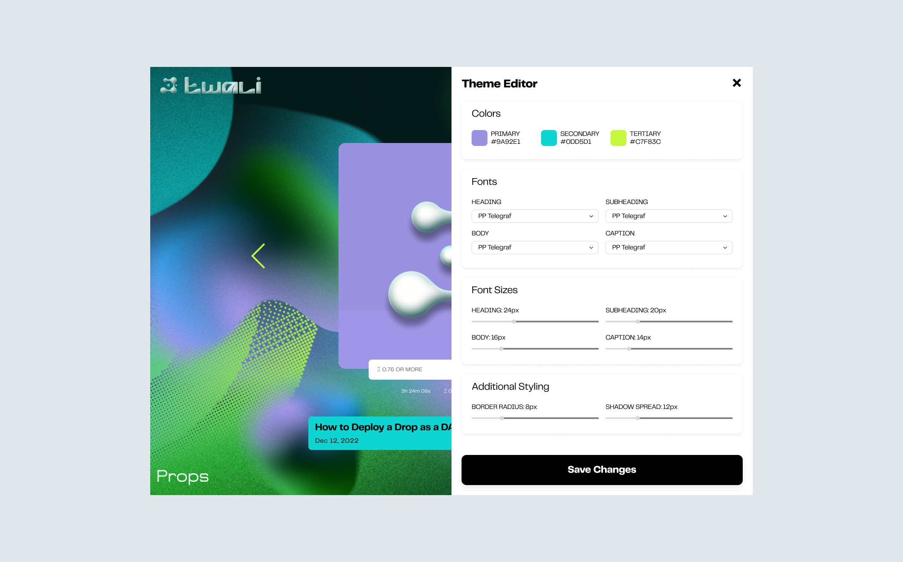

# Customizing Your Theme
 
import { Callout, Tab, Tabs } from 'nextra-theme-docs'

<Callout type="warning" emoji="⚠️">
  This page is under construction.
</Callout>

Lorem ipsum dolor sit amet, consectetur adipiscing elit, sed do eiusmod tempor incididunt ut labore et dolore magna aliqua. Ut enim ad minim veniam, quis nostrud exercitation ullamco laboris nisi ut aliquip ex ea commodo consequat. Duis aute irure dolor in reprehenderit in voluptate velit esse cillum dolore eu fugiat nulla pariatur.


## Presets
Excepteur sint occaecat cupidatat non proident, sunt in culpa qui officia deserunt mollit anim id est laborum.

  <Tabs items={["Light", "Dark", "Stylized"]} storageKey="selected-pkg-manager" defaultIndex="0">
    <Tab>
      ```json copy
      // ThemeIndex: 0
      {
         "colors":{
            "background":"#FF89de",
            "text":"#00000",
            "primary":"#FFFFFF",
            "secondary":"#FFFFFF",
            "tertiary":"",
            "caption":""
         },
         "fonts":{
            "heading":"",//ttf file saved in ipfs using pinata or another service
            "body":"", //ttf file saved in ipfs using pinata or another service
            "caption":".ttf"
         },
         "font_sizes":{
            "navigation":"",
            "heading":"62px",
            "subheading":"",
            "body":"21px",
            "caption":"8px"
         },
         "modifiers":{
            "border_radius":"24.625px",
            "button_radius":"",
            "shadow_spread":"8px",
            "shadow_color":"8,8,8"
            },
         "font_weights":{
         }
      }
      ```
      
      ```solidity copy
      Theme Address: 0x4dADF2110d5D1a0dF4E9B17bb2249EcD88A0c9Ee
      ```
      [viewThemeURI](https://public---assembly.com)
    </Tab>
    <Tab>
      ```json copy
      // ThemeIndex: 1
      {
         "colors":{
            "background":"#FF89de",
            "text":"#00000",
            "primary":"#FFFFFF",
            "secondary":"#FFFFFF",
            "tertiary":"",
            "caption":""
         },
         "fonts":{
            "heading":"",//ttf file saved in ipfs using pinata or another service
            "body":"", //ttf file saved in ipfs using pinata or another service
            "caption":".ttf"
         },
         "font_sizes":{
            "navigation":"",
            "heading":"62px",
            "subheading":"",
            "body":"21px",
            "caption":"8px"
         },
         "modifiers":{
            "border_radius":"24.625px",
            "button_radius":"",
            "shadow_spread":"8px",
            "shadow_color":"8,8,8"
            },
         "font_weights":{
         }
      }
      ```
      ```solidity copy
      Theme Address: 0x94bC0C9B80f92bBD7E5e6531E03a30ccA95d2286
      ```
      [viewThemeURI](https://public---assembly.com)
    </Tab>
    <Tab>
      ```json copy
      // ThemeIndex: 2
      {
         "colors":{
            "background":"#FF89de",
            "text":"#00000",
            "primary":"#FFFFFF",
            "secondary":"#FFFFFF",
            "tertiary":"",
            "caption":""
         },
         "fonts":{
            "heading":"",//ttf file saved in ipfs using pinata or another service
            "body":"", //ttf file saved in ipfs using pinata or another service
            "caption":".ttf"
         },
         "font_sizes":{
            "navigation":"",
            "heading":"62px",
            "subheading":"",
            "body":"21px",
            "caption":"8px"
         },
         "modifiers":{
            "border_radius":"24.625px",
            "button_radius":"",
            "shadow_spread":"8px",
            "shadow_color":"8,8,8"
            },
         "font_weights":{
         }
      }
      ```

      ```solidity copy
      Theme Address: 0x7908983cFD39c2a4754196142CB481A40c3Ab0Fe
      ```
    </Tab>
  </Tabs>
